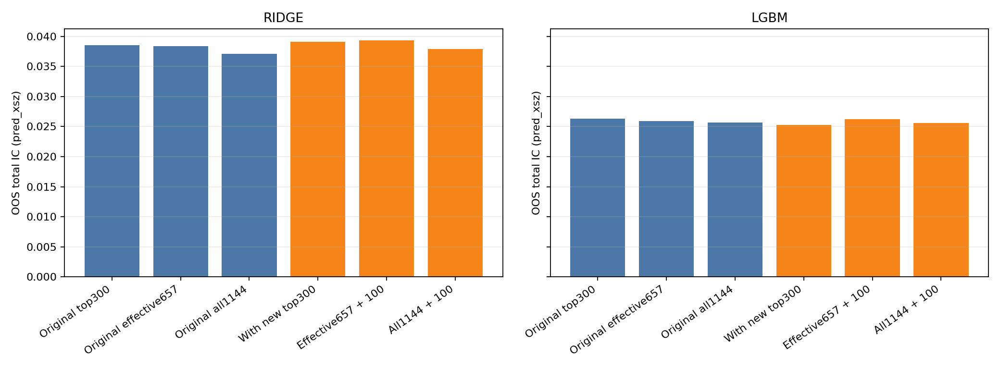
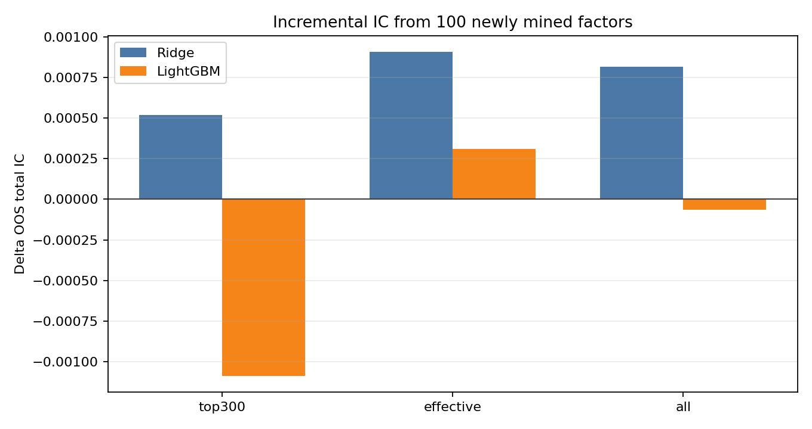
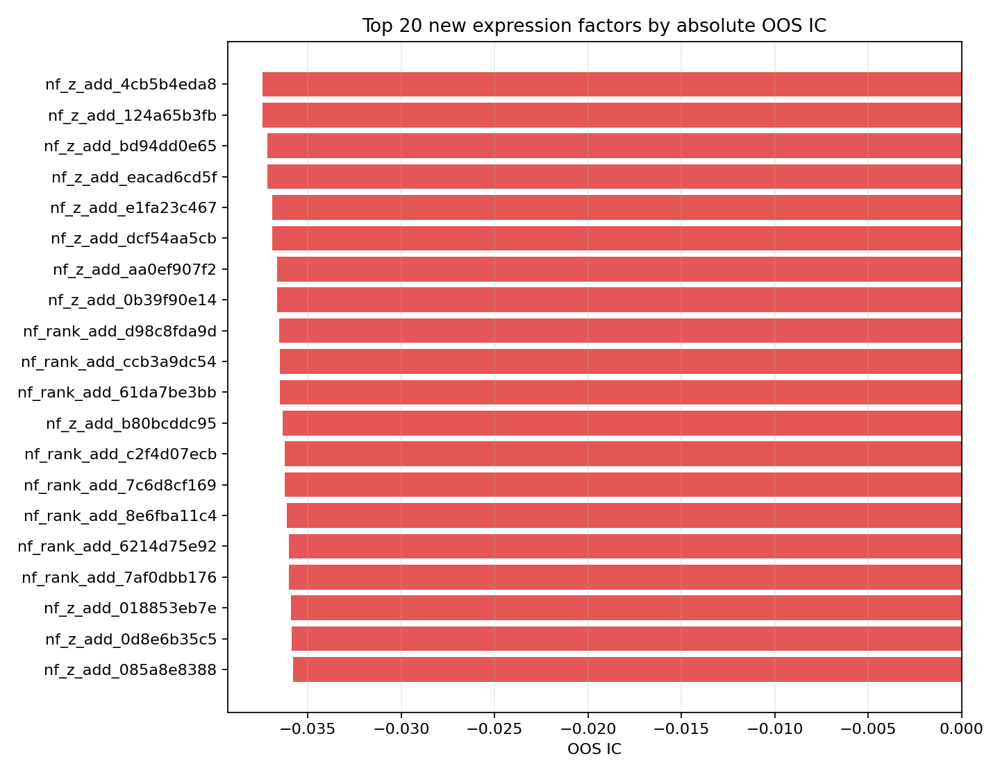
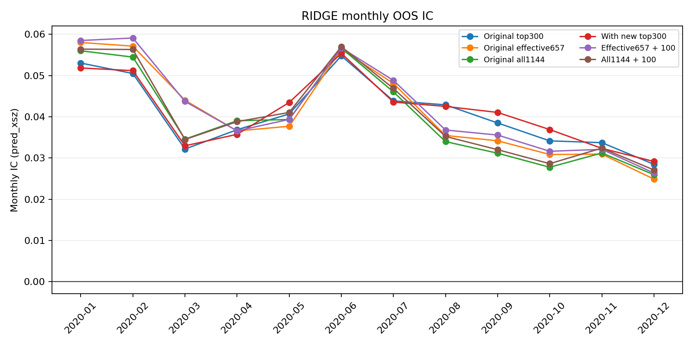
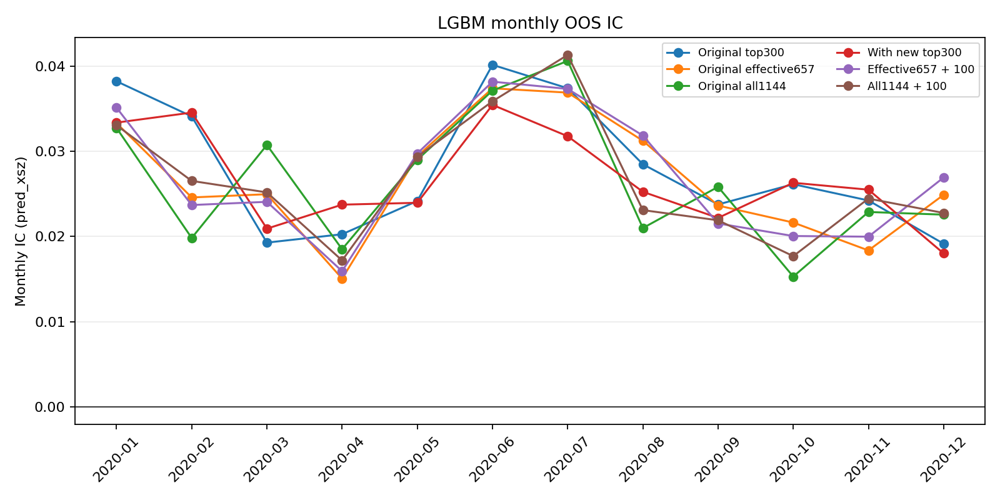

# Futures Alpha Mining Migration Report

## Scope

- Project path: `/root/autodl-tmp/fu-alpha-research`
- IS window: `2018-01-01` to `2019-12-31`.
- OOS window: `2020-01-01` to `2020-12-31`.
- Original factor pool: 1144 factors.
- Newly mined expression candidates: 4000.
- New factors passing the same-sign IS/OOS screen: 2535.
- Selected new effective factors: 100.

## Mining Method

The new factors are not copied from the original 1144 columns. They are generated as deterministic expression factors over strong original seeds, using cross-sectional rank/zscore operators such as `xrank(a) + xrank(b)`, `xrank(a) - xrank(b)`, gated ranks, and zscore products/spreads. The production entry point is `scripts/run_continuous_factor_mining.py`: it generates candidates, computes monthly IS/OOS IC parts, aggregates them, and expands the search pool until the target count is reached.

The effective-factor screen used here is:

- same sign between IS IC and OOS IC
- `abs(IS IC) >= 0.002`
- `abs(OOS IC) >= 0.001`
- IS/OOS coverage proxy >= 0.5

## Feature Sets

| set | path | features | original_features | new_features |
| --- | --- | --- | --- | --- |
| orig_top300 | /root/autodl-tmp/fu-alpha-research/outputs/model_feature_sets/orig_top300.txt | 300 | 300 | 0 |
| orig_effective657 | /root/autodl-tmp/fu-alpha-research/outputs/model_feature_sets/orig_effective657.txt | 657 | 657 | 0 |
| orig_all1144 | /root/autodl-tmp/fu-alpha-research/outputs/model_feature_sets/orig_all1144.txt | 1144 | 1144 | 0 |
| new_top300 | /root/autodl-tmp/fu-alpha-research/outputs/model_feature_sets/new_top300.txt | 300 | 200 | 100 |
| new_effective757 | /root/autodl-tmp/fu-alpha-research/outputs/model_feature_sets/new_effective757.txt | 757 | 657 | 100 |
| new_all1244 | /root/autodl-tmp/fu-alpha-research/outputs/model_feature_sets/new_all1244.txt | 1244 | 1144 | 100 |

## Model IC Results

Main reported column is `pred_xsz`, the cross-sectional z-scored prediction view used for the baseline comparison.

| name | set_label | total_ic | monthly_mean | monthly_ir |
| --- | --- | --- | --- | --- |
| lgbm_orig_top300 | Original top300 | 0.026351 | 0.027944 | 3.659207 |
| lgbm_orig_effective657 | Original effective657 | 0.025890 | 0.026782 | 3.823245 |
| lgbm_orig_all1144 | Original all1144 | 0.025679 | 0.026344 | 3.381718 |
| lgbm_new_top300 | With new top300 | 0.025263 | 0.026749 | 4.694942 |
| lgbm_new_effective757 | Effective657 + 100 | 0.026199 | 0.027034 | 3.668972 |
| lgbm_new_all1244 | All1144 + 100 | 0.025615 | 0.026533 | 3.671776 |
| ridge_orig_top300 | Original top300 | 0.038573 | 0.040795 | 4.800481 |
| ridge_orig_effective657 | Original effective657 | 0.038414 | 0.041175 | 3.628340 |
| ridge_orig_all1144 | Original all1144 | 0.037073 | 0.039677 | 3.583894 |
| ridge_new_top300 | With new top300 | 0.039094 | 0.041335 | 4.952686 |
| ridge_new_effective757 | Effective657 + 100 | 0.039323 | 0.042098 | 3.750996 |
| ridge_new_all1244 | All1144 + 100 | 0.037890 | 0.040518 | 3.669451 |

## Incremental Effect From New Factors

| model | group | original_total_ic | with_new_total_ic | delta_total_ic | relative_delta_pct |
| --- | --- | --- | --- | --- | --- |
| ridge | top300 | 0.038573 | 0.039094 | 0.000521 | 1.35% |
| ridge | effective | 0.038414 | 0.039323 | 0.000909 | 2.37% |
| ridge | all | 0.037073 | 0.037890 | 0.000817 | 2.20% |
| lgbm | top300 | 0.026351 | 0.025263 | -0.001088 | -4.13% |
| lgbm | effective | 0.025890 | 0.026199 | 0.000308 | 1.19% |
| lgbm | all | 0.025679 | 0.025615 | -0.000065 | -0.25% |

## Backtest Summary

Long-short uses top/bottom 20% by `pred_xrank` within each timestamp.

| name | mean | tstat | hit_rate | cum_return |
| --- | --- | --- | --- | --- |
| lgbm_orig_top300 | 0.000256 | 33.907603 | 0.562594 | 19.687215 |
| lgbm_orig_effective657 | 0.000270 | 35.968677 | 0.569200 | 20.811767 |
| lgbm_orig_all1144 | 0.000273 | 35.953749 | 0.566499 | 20.974795 |
| lgbm_new_top300 | 0.000251 | 32.355631 | 0.563187 | 19.384648 |
| lgbm_new_effective757 | 0.000268 | 35.061971 | 0.571054 | 20.675026 |
| lgbm_new_all1244 | 0.000265 | 34.683083 | 0.564765 | 20.388265 |
| ridge_orig_top300 | 0.000351 | 45.145046 | 0.584942 | 26.845530 |
| ridge_orig_effective657 | 0.000350 | 47.218959 | 0.587962 | 26.886657 |
| ridge_orig_all1144 | 0.000333 | 43.962638 | 0.583665 | 25.525117 |
| ridge_new_top300 | 0.000355 | 45.645618 | 0.587511 | 27.225111 |
| ridge_new_effective757 | 0.000360 | 48.152233 | 0.591357 | 27.615198 |
| ridge_new_all1244 | 0.000341 | 45.010575 | 0.586185 | 26.159415 |

## Top New Factors

| name | formula | is_ic | oos_ic |
| --- | --- | --- | --- |
| nf_z_add_4cb5b4eda8 | xzscore(macd_5_21) + xzscore(csr_cpos) | -0.049269 | -0.037415 |
| nf_z_add_124a65b3fb | xzscore(csz_macd_5_21) + xzscore(csr_cpos) | -0.049269 | -0.037415 |
| nf_z_add_bd94dd0e65 | xzscore(csr_cpos) + xzscore(macd_3_13) | -0.046305 | -0.037152 |
| nf_z_add_eacad6cd5f | xzscore(csz_macd_3_13) + xzscore(csr_cpos) | -0.046305 | -0.037152 |
| nf_z_add_e1fa23c467 | xzscore(macd_5_21) + xzscore(tsz_cpos) | -0.048512 | -0.036893 |
| nf_z_add_dcf54aa5cb | xzscore(csz_macd_5_21) + xzscore(tsz_cpos) | -0.048512 | -0.036893 |
| nf_z_add_aa0ef907f2 | xzscore(macd_3_13) + xzscore(tsz_cpos) | -0.045592 | -0.036656 |
| nf_z_add_0b39f90e14 | xzscore(csz_macd_3_13) + xzscore(tsz_cpos) | -0.045592 | -0.036656 |
| nf_rank_add_d98c8fda9d | xrank(csr_cpos) + xrank(tsz_macd_5_21) | -0.046649 | -0.036548 |
| nf_rank_add_ccb3a9dc54 | xrank(csz_macd_5_21) + xrank(csr_cpos) | -0.047567 | -0.036513 |
| nf_rank_add_61da7be3bb | xrank(macd_5_21) + xrank(csr_cpos) | -0.047537 | -0.036513 |
| nf_z_add_b80bcddc95 | xzscore(csr_cpos) + xzscore(tsz_macd_5_21) | -0.046062 | -0.036341 |

## Figures

## Conclusion

Ridge benefits from the newly mined factor skill across all three comparisons. The strongest Ridge result is `ridge_new_effective757`, with OOS total IC 0.039323, versus 0.038414 for the original effective657 set.

LightGBM does not show broad incremental gain from this first 100-factor batch. The effective set improves slightly, while top300 and all-factor variants are flat to lower. That suggests the expression mining improves the linear signal stack more reliably than the current lightweight tree configuration; LightGBM likely needs a separate tuning/pass for feature redundancy and regularization.
